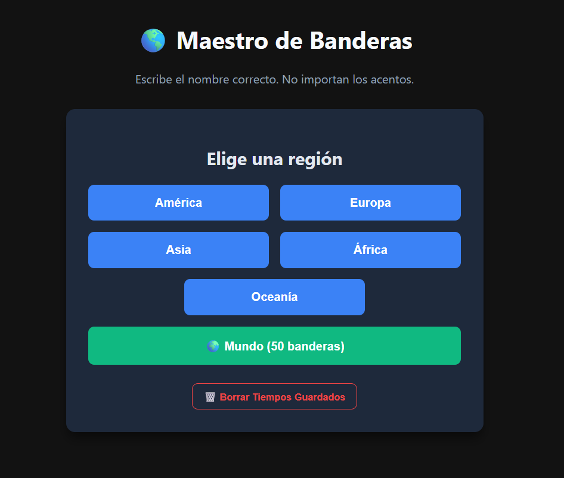

# 🌎 Maestro de Banderas - World Flags Quiz Game

[](https://assambledgame12.github.io/FlagsGame/)
[](#️-tecnologías-utilizadas)

**Maestro de Banderas** es un juego interactivo de adivinanzas de banderas del mundo desarrollado con HTML, CSS y JavaScript puro. Pon a prueba tus conocimientos de geografía, compite contra tu propio tiempo y aprende las banderas de todos los continentes.

Funciona tanto **en línea** como de forma totalmente **offline** sin necesidad de conexión a internet ni dependencias externas.

---

## 🖼️ Vista Previa



---

## 🚀 Probar el Juego

* 🌐 **Jugar en Web (GitHub Pages):** [https://assambledgame12.github.io/FlagsGame/](https://assambledgame12.github.io/FlagsGame/)
* 💻 **Jugar Offline (Local):** Clona el repositorio y abre `index.html` directamente en cualquier navegador web.

---

## ✨ Características Principales

- 🗺️ **Modos por Continente y Global:**
  - **América:** 35 banderas
  - **Europa:** 46 banderas
  - **Asia:** 49 banderas
  - **África:** 54 banderas
  - **Oceanía:** 14 banderas
  - 🌍 **Mundo:** Modo reto especial con 50 banderas aleatorias seleccionadas de todo el mundo.
- 🔀 **Orden Aleatorio:** Cada partida desordena la lista de banderas para que nunca juegues el mismo orden.
- 🔤 **Tolerancia Inteligente de Textos:**
  - **Sin sensibilidad a acentos ni mayúsculas:** Acepta "Mexico" o "México", "Peru" o "Perú", etc.
  - **Múltiples sinónimos válidos:** Reconoce respuestas alternativas (ej. *EEUU / USA / Estados Unidos*, *Holanda / Países Bajos*, *Inglaterra / Gran Bretaña / Reino Unido*).
- ⏱️ **Sistema de Cronómetro y Récords:**
  - Mide el tiempo exacto que tardas en completar cada región.
  - Guarda tus mejores tiempos localmente con `localStorage`.
  - **Requisito de Récord:** Solo se registra o actualiza tu mejor tiempo si logras un **100% de aciertos (puntaje perfecto)**.
  - Opción de borrar todos los tiempos guardados directamente desde el menú principal.
- 💡 **Opción "No me la sé" (Saltar):** Si no recuerdas un país, puedes revelar la respuesta correcta para aprenderla y continuar el juego.
- 🎨 **Diseño Moderno en Modo Oscuro:** Interfaz limpia con variables CSS, animaciones interactivas (efecto sacudida en error) y adaptabilidad responsiva.
- ⚡ **100% Offline / Cero Dependencias:** Todo el código y los recursos visuales residen localmente en la carpeta del proyecto.

---

## 🎮 Cómo Jugar

1. Selecciona el continente que deseas practicar o elige el reto **🌍 Mundo (50 banderas)**.
2. Observa la bandera en pantalla.
3. Escribe el nombre del país en el campo de texto y presiona **Enter**.
4. Si aciertas, el juego avanzará de inmediato a la siguiente bandera.
5. Si respondes mal, el campo temblará en rojo e indicará el error.
6. Si desconoces la respuesta, haz clic en **"No me la sé"** para ver el nombre correcto y continuar.
7. Al finalizar, el juego te mostrará tus aciertos a la primera, tiempo total transcurrido y si alcanzaste un **nuevo récord personal**.

---

## 📁 Estructura del Repositorio

```text
FlagsGame/
├── banderas/          # Colección local de imágenes de banderas (.png por código de país)
│   ├── ar.png
│   ├── es.png
│   ├── mx.png
│   └── ...
├── index.html         # Aplicación completa (HTML5 + CSS3 + JS Vanilla)
├── Preview.png        # Captura/Imagen de demostración para GitHub
└── README.md          # Documentación del proyecto
